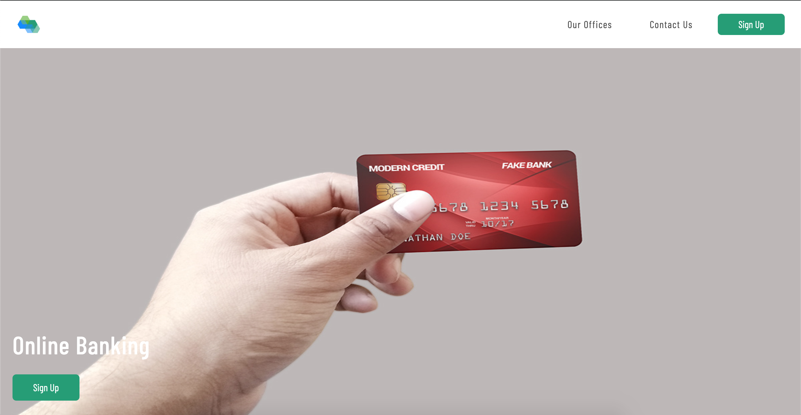

# Online Banking

Milestone Project 2: Interactive Frontend Development - Code Institute

This is a website for prospect to discover about the project of Online Banking. It allows them to learn about the features of Online Banking, contact Online Banking company through a form, see where their offices are located and to sign up to receive updates. 

This website is to show off my coding skills in HTML, CSS and Javascript. I decided to not use Bootstrap a lot.

## Demo

A live demo can be found [here](https://comanezz.github.io/online-banking/).
<br>
<br>
<a href="https://comanezz.github.io/online-banking/" target="_blank"></a>

## UX
**The primary target audiences are prospect who might be interested to sign up to learn more about Online Banking.**

#### User Stories:

- As a new visitor, I want to learn about the feature of Online Banking.
- As a new visitor, I want to see where the offices are located.
- As a new visitor, I want to contact Online Banking.
- As a new visitor, I want to sign up to get updated.

#### This project is the best way to achieve these things because:

- This website is easy to navigate.
- There is no overloading information.
- All different information can be found easily.
- It works well on every device.
- All the links redirect the user to the correct page.
- The contact form send the request of the user to the inbox of Online Banking.

#### Wireframes

- [Desktop view](https://github.com/comanezz/online-banking/tree/master/assets/mockup/desktop-view)
- [Mobile view](https://github.com/comanezz/online-banking/tree/master/assets/mockup)

## Features

**All pages**

- Each page has a responsive **navbar** with a **Sign Up** button that will pop a form when clicked. 
- Each page has a footer with **Social Media Icons** linking to the social media pages.

When clicking on the **Sign Up** button a pop up form will show up. The form require to fill informations as name, email, password and confirm password. At the bottom of the form there is a "Register" button. Once the form filled correctly and the "register" button clicked, an alert message will appear and the form will close. 

**Home page**

The "Home" page has slides animations when scrolling down. Used this [script](https://github.com/comanezz/online-banking/blob/master/assets/js/script-waypoints.js) for the scrolling event.

**Office page**

The "Office" page has two maps to show the location of the offices. Used this [script](https://github.com/comanezz/online-banking/blob/master/assets/js/maps.js) to show the maps.

**Contact**

The "Contact" page features a contact form to enable client to send a request. The form require to fill informations such as email, name and a message. At the bottom of the form there is a "submit" button to enable the client to confirm the request. Once the request is sent, there is an alert saying that the form has been submitted and the submit button becomes unavailable and grey.

## Technologies Used

- **HTML5**
- **CSS3**
- [CSS library](https://github.com/daneden/animate.css) used for the slide animation
- [Bootstrap Framework](https://getbootstrap.com/)
  - The project uses a little bit of **Bootstrap4**.
- [Font Awesome 4.7](https://fontawesome.com/v4.7.0/)
    - The project uses **Font Awesome** to provide icons.
- [Google Fonts](https://fonts.google.com/)
  - The project uses **Google Fonts** to style the website fonts.
- **Javascript libraries**
    - [JQuery](https://jquery.com) used to simplify DOM manipulation.
    - [Waypoints](http://imakewebthings.com/waypoints/) library used to trigger an action when scrolling.
- **IDE** used to develop the website: writting, debugging and running the code.
  - [Cloud9 IDE](https://aws.amazon.com/cloud9/?origin=c9io)
  - [Visual Studio Code](https://code.visualstudio.com/)

## Testing

- [W3C CSS Validation Service](https://jigsaw.w3.org/css-validator/) and [W3C Markup Validation Service](https://validator.w3.org/) has been used to check the validity of the website code.

- The website has been tested on several browsers (**Chrome, Safari, Firefox**). It has been tested by using [Chrome DevTools](https://developers.google.com/web/tools/chrome-devtools/) to check the mobile view but also tested on a OnePlus 5 mobile and an Ipad.

### All pages
- The website is fully responsive and behave as expected.

- The logo (in the navbar) always leads back the user to the Home page.

- Every link in the navbar redirect the user to the appropriate page.

- All the links in the navbar behave correctly when hovering. 

- Sign up button in the navbar works correcly (Form pop up). 

- All the social icons in the footer behave correctly when hovering.

- All social media links in the footer will open a new tab using target="_blank" and redirect user to the correct page.

### Pop up form on every page
1. Sign Up form:
    1. Click on the **Sign Up** button (located in every page).
    2. Try to submit the empty form and verify that an error message about the required fields appears.
    3. Try to submit the form with all valid input except **email address** (left blank or invalid email address) and verify that a relevant error message appears.
    4. Try to submit the form with all valid input except **Name**  and verify that a relevant error message appears.
    5. Try to submit the form with all valid input except **Password** and verify that a relevant error message appears.
    6. Try to submit the form with all valid input except **Confirm Password** and verify that a relevant error message appears.
    7. Try to submit the form with all valid input except **Password and Confirm Password** with less than 8 characters in length and verify that a relevant error message appears.
    8. Try to submit the form with all valid input except **Password and Confirm Password** password not matching and verify that a relevant error message appears.
    9. Try to submit the form with all valid inputs and verify that no error message appears.

### Home page
- On Ipad view or above slide animation working correctly. 
- Sign up button in the first section part works correctly (form pop up).

### Office page
- Maps works correctly when loading the page - Markers are placed correctly

### Contact page
1. Contact form:
    1. Go to the **Contact us** page.
    2. Try to submit the empty form and verify that an error message about the required fields appears.
    3. Try to submit the form with all valid input except **email address** (left blank or invalid email address) and verify that a relevant error message appears.
    4. Try to submit the form with all valid input except **Name**  and verify that a relevant error message appears.
    5. Try to submit the form with all valid input except **Message** and verify that a relevant error message appears.
    6. Try to submit the form with all valid inputs and verify that no error message appears.

### Problems
- Home page was not responsive on mobile. The navbar was not reacting as expected - The issue was coming from the animation css that I added. To resolve this issue I had to remove the animation scrolling on mobile view. 
- When pop up form is shown on the page we can not leave the pop up form by clicking outside of it. You can only leave the pop up form by filling the form or by clicking on the "X". Solution not found even the mentor did not find any solution for this.

## Deployment

**This website is hosted using GitHub pages, the deployment steps were:**

This site is hosted using GitHub pages, deployed directly from the master branch. The deployed site will update automatically upon new commits to the master branch. In order for the site to deploy correctly on GitHub pages, the landing page must be named index.html.

**To run locally, you can clone this repository directly into the editor of your choice by following these steps:**

1. On GitHub, navigate to the main page of the repository.
2. Under the repository name, click **Clone or download**.
3. In the Clone with HTTPs section, copy the clone URL for the repository.
4. Open the terminal.
5. Type `git clone`, and then paste the URL you copied in Step 3.
``` console
$ git clone https://github.com/USERNAME/REPOSITORY
```
6.Press **Enter**. Your local clone will be created.

To cut ties with this GitHub repository, type `git remote rm origin` into the terminal.

## Credits

### Content
- Some text were taken from [N26](https://n26.com/en-eu).

### Media

- The logo was created on [Free Logo Design](https://fr.freelogodesign.org/)
- The menu button was taken from [Awwwards site](https://www.awwwards.com/sites/product-designer-patryk-kopec)
- Card images and smartphones images in Home page were taken from **Google Images**.
- Image on contact us page taken from **Google Images**

### Acknowledgements

- I received inspiration for this project from [N26](https://n26.com/en-eu).

**This is for educational use.**